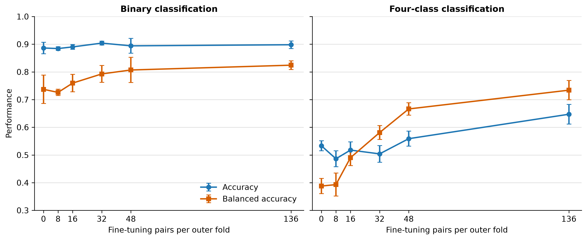

# Three-API fine-tuning learning curve results

The formal learning-curve experiment completed 24 summary runs and all 120
outer-fold evaluations. Each task used pretrained checkpoints from model seeds
42/43/44 and the same coformer-grouped five-fold target split as the primary
three-API experiment.

Within each outer-fold training partition, the 8, 16, 32, and 48-pair subsets
were deterministic, nested, and balanced over the four original classes. No
outer-fold test pair controlled optimization or checkpoint selection. The same
physical-pair subsets were used for the binary and four-class tasks; after
binary label collapse their negative-to-positive ratio is therefore 1:3.

## Main results

Values are mean +/- sample standard deviation over three model seeds. Zero-shot
and full-data results come from the matching formal three-API experiment.

| Fine-tuning pairs per fold | Binary accuracy | Binary BAcc | Four-class accuracy | Four-class BAcc |
|---:|---:|---:|---:|---:|
| 0 | 0.886 +/- 0.021 | 0.737 +/- 0.051 | 0.533 +/- 0.018 | 0.388 +/- 0.028 |
| 8 | 0.884 +/- 0.007 | 0.726 +/- 0.011 | 0.486 +/- 0.029 | 0.393 +/- 0.041 |
| 16 | 0.890 +/- 0.009 | 0.759 +/- 0.031 | 0.518 +/- 0.029 | 0.490 +/- 0.028 |
| 32 | 0.904 +/- 0.007 | 0.793 +/- 0.030 | 0.504 +/- 0.030 | 0.581 +/- 0.025 |
| 48 | 0.894 +/- 0.027 | 0.807 +/- 0.046 | 0.559 +/- 0.027 | 0.666 +/- 0.022 |
| 136 | 0.898 +/- 0.014 | 0.824 +/- 0.016 | 0.647 +/- 0.036 | 0.734 +/- 0.035 |

## Interpretation

Binary performance approaches saturation early. Balanced accuracy improves
from 0.737 without target-domain fine-tuning to 0.793 with 32 pairs and 0.807
with 48 pairs, compared with 0.824 using the complete 136-pair outer-fold
training partition. The small reduction in ordinary accuracy from 32 to 48
pairs is not consistent across seeds; balanced accuracy increases overall.

Four-class balanced accuracy increases at every measured subset size: 0.388,
0.393, 0.490, 0.581, 0.666, and 0.734 from zero-shot through full-data
fine-tuning. Between 8 and 48 pairs, the mean increase is 0.273 and is positive
for every model seed. The gain is driven by minority-class adaptation: negative
recall increases from 0.531 to 0.704, salt recall from 0.118 to 0.902, and
hydrate/solvate recall from 0.367 to 0.600. Cocrystal recall decreases from
0.557 to 0.459 as the model stops defaulting as strongly to the target set's
majority class.

Ordinary four-class accuracy is not strictly monotonic because 106 of the 170
target pairs are cocrystals. Balanced accuracy is the appropriate primary
learning-curve measure for this imbalanced target set. The curve supports the
paper's domain-adaptation rationale: target-domain examples provide a clear,
dose-dependent improvement, especially for four-class prediction, while the
binary task requires fewer examples to approach its full-data performance.

Small subset sizes necessarily produce noisy inner validation folds, so the
three-seed standard deviations and the complete outer-fold predictions should
be retained in the supplementary record. The result should not be presented as
a formal sample-complexity bound.

## Reproducibility record

- Run directory: `runs/revision-three-api-learning-curve-formal`
- Learning-curve summary JSON SHA-256:
  `ca12079e38184bbab3837b4f065e1834e9943e1396f9e4513913db285876be3a`
- Per-run CSV SHA-256:
  `83021692f334b2d6140e7cbc02c364387eb0e415aed9f098067d13dba89ceb65`
- Summary runs: 24/24
- Selection stages: 120/120
- Final outer-fold prediction files: 120/120
- Subset seed: 42
- Model seeds: 42, 43, 44
- Figure source: `docs/figures/revision-three-api-learning-curve.csv`
